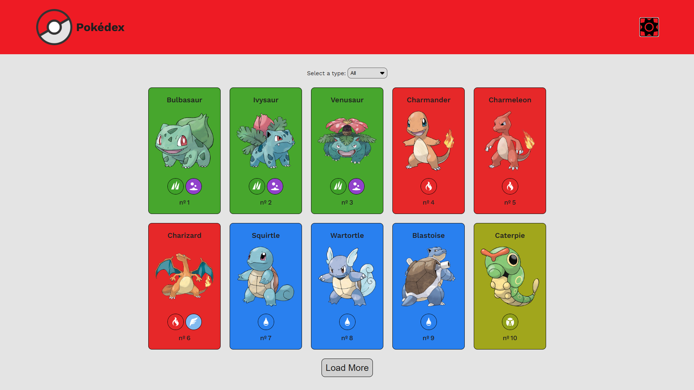
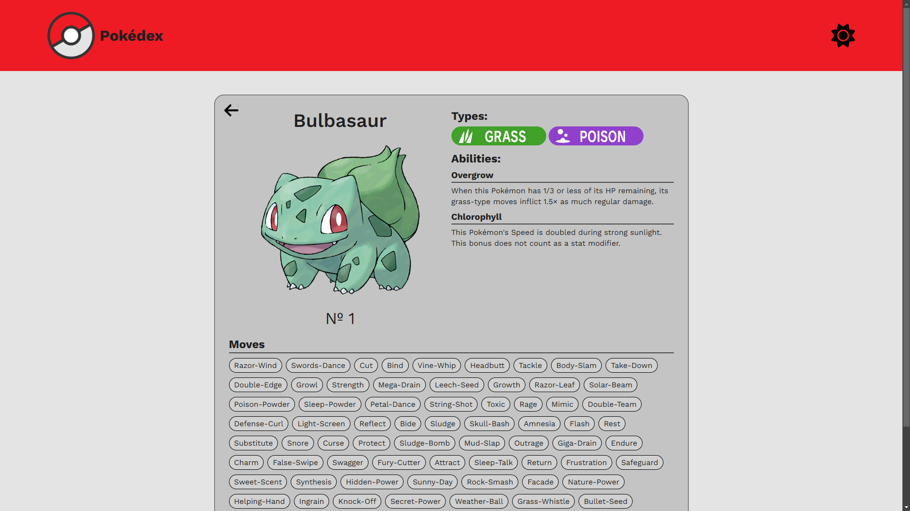

# Projeto Pokédex

Este projeto é uma quest do curso DevQuest, um exercício para treinar e aperfeiçoar minhas habilidades de HTML, CSS, Javascript, React e Context API, e também desenvolver um site do zero, aprendendo o uso de API's e tomando decisões durante a realização do projeto.

## Screenshots






## Funcionalidades

O projeto é um site que simula uma pokédex, mostrando uma lista de diversos pokémons, com seus nomes, tipos e número do pokémon. A lista também pode ser filtrada por determinados tipos de pokémon ao selecionar a opção desejada no campo de input.

Abaixo da lista, há um botão Load More que irá carregar e adicionar mais 10 pokémons na lista.

Ao clicar em um dos pokémons, você será redirecionado a uma página com informações detalhadas sobre o pokémon selecionado, incluindo:

- Nome
- Id
- Imagem do pokémon
- Habilidades e seus efeitos
- Os Tipos do pokémon
- Uma lista de movimentos do pokémon

Também se encontra no canto superior direito um botão para alternar o tema do site entre modo claro e escuro.

O site também é completamente responsivo, o que significa que poderá ser acessado em qualquer dispositivo.

## Ferramentas utilizadas

- HTML, CSS e Javascript para a criação da estrutura do site;
- ReactJS para criar uma Single Page Application (SPA);
- Context API para mudar o tema do site ao clicar no botão de mudar o tema;
- Styled Components para estilizar a página;
- React Router Dom para navegação das páginas;
- PokéAPI para buscar as informações dos pokémons.

## Processo

Durante a criação do projeto, primeiro estudei e botei em prática os conceitos de como a API fornecida funcionava para eu poder me habituar a seu uso.

Comecei criando as páginas no React Router Dom para ter uma base de onde começar, dividindo entre a página principal com a lista de pokémons e a página com os detalhes do pokémon selecionado.

Depois, fui criando a estrutura da página e dividindo os trechos de código em componentes para uma melhor organização.

Primeiro estruturei a página, depois implementei as funcionalidades com Javascript e apenas no fim trabalhei com a estilização do projeto.

### Dificuldades

Um obstáculo na criação deste projeto foi aprender a usar a API fornecida, algo que conseguir superar lendo a documentação e fazendo testes.

Também tive alguns receios em relação a organização de pastas, e qualquer dica seria de grande ajuda!

Uma das minhas maiores dificuldades foi conseguir fazer o deploy do projeto no GitHub Pages, pois eu nunca havia feito um antes, mas depois de muita pesquisa e alterações no código, finalmente consegui!

Qualquer feedback de como melhorar o código é bem vindo! Seja relacionado ao método de deploy quanto de outros aspectos do projeto.

## Como rodar o projeto?

### Link

Abra o projeto hospedado no GitHub Pages: [https://eikidev.github.io/pokedex/](https://eikidev.github.io/pokedex/)

### Através do `npm run dev`

- Primeiro é necessário baixar a pasta do projeto no seu computador;
- Em seguida, abra o terminal na pasta e digite `npm install` para baixar todas as dependências do projeto;
- Vá no arquivo `vite.config.js` e comente temporariamente o trecho: 
``` js
import { defineConfig } from 'vite'
import react from '@vitejs/plugin-react'

// https://vitejs.dev/config/
export default defineConfig({
  plugins: [react()],
  base: "/pokedex", // comente nesta linha
  publicDir: 'public',
  build: {
    outDir: 'dist',
    assetsDir: "assets",
  },
})

```

- Após isso, vá ao terminal e digite `npm run dev` e aparecerá um link;
- Para clicar, pressione a tecla Ctrl e clique com o botão esquerdo nele;
- O projeto abrirá no seu navegador.

Para fechar o projeto, apenas vá no terminal e pressione Ctrl + C e o terminal irá parar de rodar o site e você poderá fechar o terminal.